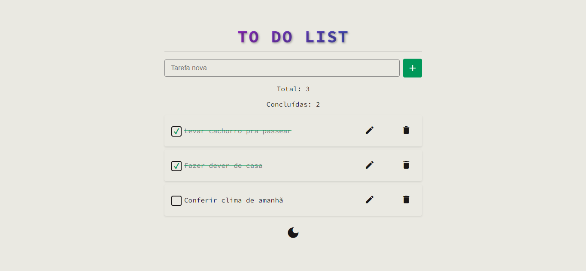
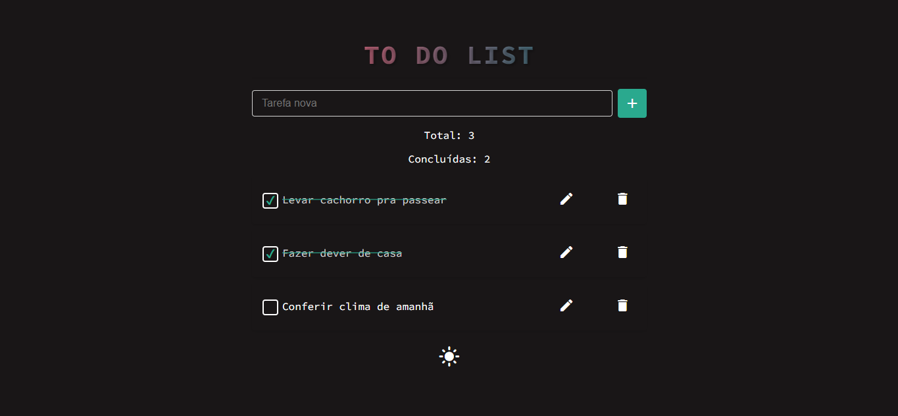

# TodoList

## Aplicação simples de lista de tarefas na web.

### Descrição

Uma aplicação onde os usuários podem criar, editar, excluir e marcar tarefas como concluídas.

Este projeto foi gerado utilizando o [Angular CLI](https://github.com/angular/angular-cli) versão 19.0.7.

### Funcionalidades

* [X]  **Adicionar tarefas**: Permite criar novas tarefas com facilidade.
* [X]  **Editar tarefas existentes**: Alterar o conteúdo ou detalhes das tarefas já criadas.
* [X]  **Excluir tarefas**: Remover tarefas indesejadas da lista.
* [X]  **Marcar tarefas como concluídas**: Indicar tarefas finalizadas.
* [X]  **Interface responsiva**: Design adaptado para dispositivos móveis e telas menores.
* [X]  **Suporte a temas dinâmicos**: Alteração automática do estilo da página com base no tema selecionado (claro ou escuro).
* [X]  **Reordenar tarefas com arrastar e soltar**: Sistema interativo que permite reorganizar a lista de tarefas usando o recurso de "clicar e arrastar" do Angular.

### Tecnologias

* **Angular**: Framework principal integrando HTML, CSS e TypeScript para criar a interface dinâmica e funcional.
* **LocalStorage**: Utilizado para persistência de dados no navegador, garantindo que tarefas e preferências sejam mantidas mesmo após a atualização da página.
* **Material Icons**: Biblioteca de ícones usada para melhorar a interface visual e experiência do usuário.

### Demonstração





### Instalação

1. Baixe o projeto e no terminal instale as dependências necessárias com o comando:

````
npm install
````

2. Após a instalação, inicie o projeto com:

```
npm start
```

👉 O projeto será executado em http://localhost:4200 no seu navegador.
